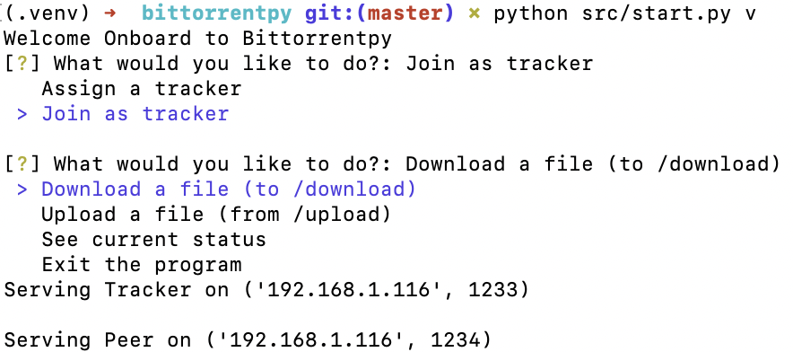

# bittorrentpy

A bittorrent implementation using sockets. 

# Requirements
`pip3 install -r requirements.txt`

# Run
`python3 src/start.py`

### Run with verbose
`python3 src/start.py v`

You need at least 2 machines to make it run.

# UI
[
